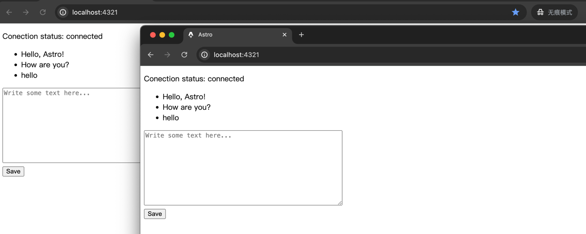

# Live-message-broadcaster (Astro SSE demo)

Real-time multi-client message synchronization system.

实时多客户端消息同步系统.

## How to use / 如何把玩
1. Run the following command in the project root directory to build the Docker image: / 在项目根目录运行以下命令来构建 Docker 镜像：

```sh
docker build -t my-astro-app .
```

2. After the build is complete, run the container with the following command: / 构建完成后，使用以下命令运行容器：

```sh
docker run -p 4321:4321 my-astro-app
```

3. Open 'localhost:4321' with multiple browser tabs, type 'hello' in one of them and send it, which is immediately displayed in the other tabs. / 使用多个浏览器标签打开 `localhost:4321`, 在其中一个输入 `hello`并发送, 会立即在其他标签页中显示

